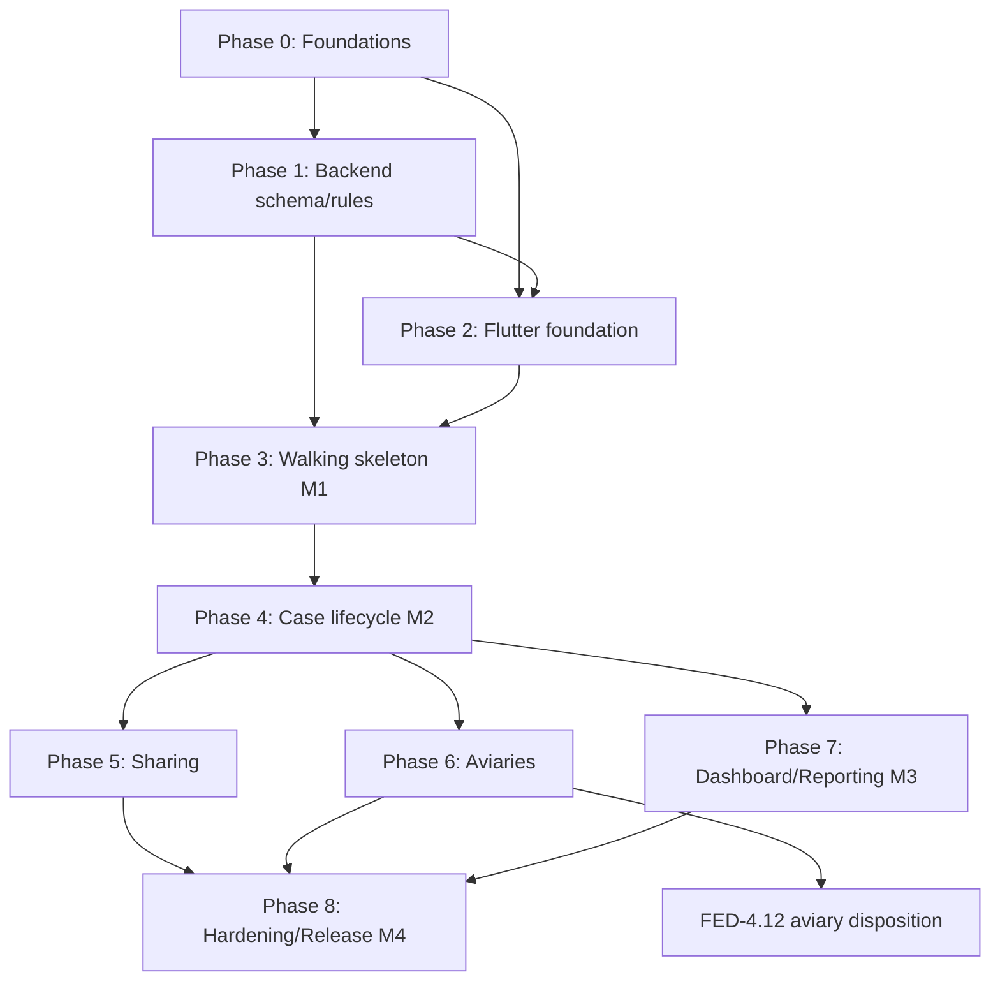

# Federfall — Implementation Plan

> Companion to `REQUIREMENTS.md`. Date: 2026-06-23 · rev. 1
> How to read this: phases group work; each task has an **ID** (`FED-n`), a one-line goal, and **deps** (task IDs it needs first). The dependency graph and critical path are in [§ Dependencies](#dependency-graph). Build order follows a **walking-skeleton → vertical-slice** strategy.

---

## Strategy

1. **Walking skeleton first.** Before building features broadly, get one *thin* slice running end-to-end through every layer and **deployed**: log in → create a case → see it in a list, on web + one mobile target. This de-risks the stack (PocketBase rules, auth token storage on web vs native, routing, CI, deploy) while the surface area is tiny.
2. **Schema-first.** The PocketBase collections + API rules are the contract everything else depends on. Lock them early (as migrations), but expect to evolve them per feature — migrations make that safe.
3. **Vertical slices over horizontal layers.** Each case feature (weights, meds, journal, …) is built top-to-bottom (rule → repo → model → viewmodel → UI → test) so it's shippable on its own.
4. **Test as you go to the ~80% bar** on the domain/repository layer; golden + a few E2E happy-paths for UI. Don't backload testing.
5. **Deploy early, deploy often.** Backend on the VPS from the skeleton milestone, so "works on prod" is continuous, not a big-bang at the end.

**Suggested repo layout** (pub workspace):
```
federfall/
  apps/federfall/            # Flutter app (very_good scaffold)
  packages/federfall_models/ # shared freezed models + mappers
  packages/federfall_data/   # repositories + PocketBase client (optional split)
  backend/pocketbase/        # pb_migrations/, pb_hooks/, seed data, Dockerfile/compose
  docs/                      # REQUIREMENTS.md, IMPLEMENTATION_PLAN.md
```

---

## Phase 0 — Foundations & toolchain

| ID | Task | Deps |
|---|---|---|
| FED-0.1 | `git init`, repo structure, `.gitignore` (pb_data, build, .env), licence | — |
| FED-0.2 | Pub workspace + scaffold Flutter app via `very_good create flutter_app` (flavors dev/prod, very_good_analysis, l10n) | FED-0.1 |
| FED-0.3 | Set name **Federfall**, app id **`de.jhbruhn.federfall`**, icons/splash placeholders, flavors wiring (`--dart-define-from-file`) | FED-0.2 |
| FED-0.4 | Add core deps: `pocketbase`, `flutter_riverpod`, `go_router`(+builder), `freezed`/`json_serializable`/`build_runner`, `flutter_secure_storage`, `flutter_map`, l10n | FED-0.2 |
| FED-0.5 | Containerized PocketBase dev setup: pinned-version `Dockerfile` + `docker-compose.yml` (pb_data volume, mounted `pb_migrations/`+`pb_hooks/`), `.env.example`, run script, Automigrate in dev, README. No host binary — `docker compose up` serves it locally | FED-0.1 |
| FED-0.6 | CI skeleton (GitHub Actions: format → analyze → test+coverage, ~80% gate on domain/repo); branch protection | FED-0.2 |

**DoD:** `flutter run` (web + Android) shows the scaffold; PocketBase serves locally; CI green on an empty test.

---

## Phase 1 — Backend: schema, rules, hooks

| ID | Task | Deps |
|---|---|---|
| FED-1.1 | Migration: `organisations` (single seed row) + `users` auth collection with `role`, `org`, `is_active`, invite fields | FED-0.5 |
| FED-1.2 | Migration: `animals` (name, species, sex, is_owned, current_aviary, lifetime_status, org) | FED-1.1 |
| FED-1.3 | Migration: `cases` (animal, case_number, age_class, intake fields, find_location+geo, reasons, quarantine_until, status, is_releasable, active_carer, optional exam fields, org) | FED-1.2 |
| FED-1.4 | Migration: `finders` (PII) | FED-1.1 |
| FED-1.5 | Migration: `markings` (animal, type, code, scheme_org, colour, applied/removed, applied_in_case) | FED-1.2, FED-1.3 |
| FED-1.6 | Migration: `conditions` code list + `case_conditions` (certainty, dates) | FED-1.3 |
| FED-1.7 | Migration: `weights`, `medications`, `journal_entries` (+ file fields), `placements` | FED-1.3 |
| FED-1.8 | Migration: `aviaries` + `dispositions` (release vs placed_in_aviary vs died/euthanized/transferred/returned_to_owner) | FED-1.3 |
| FED-1.9 | Migration: `case_shares` (case, user, access) | FED-1.3 |
| FED-1.10 | Seed: German `conditions` list (Trichomonadose, Paramyxovirose, Salmonellose, Fadenfuß, Spreizbein, Fraktur, MBD…), reasons-for-admission list | FED-1.6 |
| FED-1.11 | **API access rules** on every collection: private-by-default + case_shares + roles (carer/coordinator=all-read/supervisor) + org scope | FED-1.1–1.9 |
| FED-1.12 | JS hooks: auto `case_number` (per-year), default `quarantine_until` (+14d), maintain `status`/`lifetime_status`, share-on-handoff (previous carer keeps read) | FED-1.3, FED-1.7 |
| FED-1.13 | Rule/hook tests (scripted against a throwaway pb instance): verify visibility & handoff behaviour | FED-1.11, FED-1.12 |

**DoD:** schema reproducible from migrations on a clean instance; access rules proven by tests; sample data loads.

---

## Phase 2 — Flutter foundation (cross-cutting)

| ID | Task | Deps |
|---|---|---|
| FED-2.1 | PocketBase client provider + `AsyncAuthStore` over `flutter_secure_storage` (native) with web fallback; env-driven base URL | FED-0.4, FED-1.1 |
| FED-2.2 | freezed models + `RecordModel`→model mappers for all collections (in `federfall_models`) | FED-0.4, FED-1.* |
| FED-2.3 | Repository interfaces + PocketBase implementations (auth, cases, animals, weights, meds, journal, conditions, placements, dispositions, markings, aviaries, shares, finders) | FED-2.1, FED-2.2 |
| FED-2.4 | go_router setup: auth-guarded shell, web `usePathUrlStrategy`, error/404 routes | FED-0.4 |
| FED-2.5 | Theming + German l10n scaffolding + base widgets (forms, buttons, async/error states) | FED-0.2 |
| FED-2.6 | Light offline read cache (recently-viewed cases) behind the repository | FED-2.3 |
| FED-2.7 | App-wide error handling, Result/failure types, logging | FED-2.3 |

**DoD:** app boots to a login gate; a repository call round-trips to local PocketBase with a typed model.

---

## Phase 3 — Walking skeleton: auth + minimal case (MILESTONE M1)

| ID | Task | Deps |
|---|---|---|
| FED-3.1 | Login (email+password), session restore on launch, logout | FED-2.1, FED-2.4 |
| FED-3.2 | Invite/approval flow: supervisor invites → accept-invite sets password → role assigned | FED-3.1, FED-1.1 |
| FED-3.3 | Role-gated navigation + minimal profile | FED-3.1 |
| FED-3.4 | Minimal create-case (name + species + reason) → list of my cases → case detail stub | FED-2.3, FED-3.1 |
| FED-3.5 | **Deploy skeleton (containerized)**: VPS Docker Compose stack — Caddy(auto-TLS, reverse proxy, SPA rewrites) + PocketBase container (pinned image, pb_data volume) + Litestream sidecar backups + CORS origins; Flutter web build served; one mobile debug build. `docker compose up -d`, no host systemd/binary | FED-1.11, FED-3.4 |

**🏁 M1 — Walking skeleton deployed:** a real user logs in on prod (web + mobile) and creates/sees a case. All layers + deploy proven.

---

## Phase 4 — Core case lifecycle (the heart)

Each is a vertical slice; most depend only on the case existing (FED-3.4) + its repo (FED-2.3).

| ID | Task | Deps |
|---|---|---|
| FED-4.1 | Full intake form (light + photos) + create/link **animal**; finder capture | FED-3.4, FED-4.10 |
| FED-4.2 | Find-location: `flutter_map` (OSM tiles) + Nominatim geocoding (address ⇄ pin) | FED-4.1 |
| FED-4.3 | Case detail overview (name-first label, status, timeline) | FED-3.4 |
| FED-4.4 | Weights: add + **trend chart** | FED-4.3 |
| FED-4.5 | Conditions/diagnoses: code-list picker + free text + suspected/confirmed | FED-4.3, FED-1.10 |
| FED-4.6 | Medications: drug/dose/route/frequency/dates/controlled | FED-4.3 |
| FED-4.7 | Journal entries + photo attachments | FED-4.3 |
| FED-4.8 | Optional expandable structured exam (BCS, dehydration, body-system findings) | FED-4.1 |
| FED-4.9 | Placements / **handoff** (change active_carer, previous keeps read) | FED-4.3, FED-1.12 |
| FED-4.10 | **Markings**: apply ring/marker; **re-identification search** at intake (link to existing animal + show history) | FED-4.3 |
| FED-4.11 | Disposition: **release** (location/geo) · died · euthanized · transferred · returned-to-owner | FED-4.3, FED-4.2 |
| FED-4.12 | Disposition: **placed_in_aviary** (→ aviary; animal becomes resident) | FED-4.11, FED-6.1 |

**🏁 M2 — Full case lifecycle:** a case can be taken from intake → treatment → disposition, with re-admission linking working.

---

## Phase 5 — Sharing & visibility

| ID | Task | Deps |
|---|---|---|
| FED-5.1 | `case_shares` UI: share a case with a member (read/edit), revoke | FED-4.3, FED-1.9 |
| FED-5.2 | End-to-end visibility verification (private default, opt-in share, coordinator all-read, supervisor all) — automated | FED-5.1, FED-1.13 |

---

## Phase 6 — Aviaries

| ID | Task | Deps |
|---|---|---|
| FED-6.1 | Aviary CRUD (name, keeper, location, capacity) | FED-2.3, FED-1.8 |
| FED-6.2 | Resident list / occupancy view (cases placed in an aviary) | FED-6.1, FED-4.12 |

---

## Phase 7 — Dashboard & reporting (MILESTONE M3)

| ID | Task | Deps |
|---|---|---|
| FED-7.1 | Dashboard: active cases, intakes this year, quarantine ending soon | FED-4.* |
| FED-7.2 | Statistics: outcome breakdown, by species/condition, avg time-in-care | FED-4.11, FED-4.5 |
| FED-7.3 | CSV export for annual report | FED-7.2 |

**🏁 M3 — Reportable:** the association can produce its annual numbers.

---

## Phase 8 — Hardening, GDPR & release (MILESTONE M4 = MVP)

| ID | Task | Deps |
|---|---|---|
| FED-8.1 | Finder-PII retention: org-configurable window (default 2y) + purge/anonymise job (JS hook/cron) | FED-1.4, FED-1.12 |
| FED-8.2 | GDPR data export + delete for a person on request | FED-8.1 |
| FED-8.3 | Optional MFA (encourage for supervisors) | FED-3.1 |
| FED-8.4 | Test pass to ~80% (domain/repo) + golden tests + a few `patrol` E2E happy-paths | FED-4.*, FED-5.*, FED-7.* |
| FED-8.5 | Release builds: Android (Play internal), iOS (TestFlight), Web prod; store metadata (German) | FED-8.4 |
| FED-8.6 | Ops: backup restore drill, monitoring/uptime, self-hosted Nominatim/tiles (or documented public-OSM usage policy) | FED-3.5 |

**🏁 M4 — MVP shipped.**

---

## Post-MVP backlog (from REQUIREMENTS §11)

Nextcloud OIDC SSO · public finder portal · reminders/notifications (dates already structured) · multi-org/tenancy · vet as login role · Excel/WRMD importer · aviary **population** management · full offline-with-sync · MFA enforcement · PDF reports · animal-merge & smarter re-ID UX.

---

## Dependency graph



**Critical path:** FED-0.* → FED-1.{1,2,3,11} → FED-2.{1,2,3} → FED-3.{1,4,5} (M1) → FED-4.{1,3,11} (M2) → FED-7.* (M3) → FED-8.{4,5} (M4).
Everything in Phase 4 beyond intake/detail/disposition is parallelisable across slices once M1 lands; Phases 5/6/7 are largely independent and can run in parallel after Phase 4's core.

---

## Sequencing notes & risk

- **Schema churn:** Phase 4 will reveal field gaps. That's fine — keep changes as new migrations; never hand-edit prod schema.
- **Web auth-token storage** is the weakest security spot (LocalStorage+WebCrypto). Validate behaviour on web during M1, not at the end.
- **Nominatim usage:** start against public OSM with a proper User-Agent + rate-limit respect; self-host before real volume (FED-8.6). Decouple geocoding behind a repo so the provider can swap.
- **`case_number` & `lifetime_status`** are hook-generated — test the hooks (FED-1.13) before building UI on top.
- **Aviary-vs-release disposition** has a cross-phase dep (FED-4.12 needs FED-6.1); do release disposition first so M2 isn't blocked on aviaries.
- **Scope discipline:** resist pulling post-MVP items forward; the model is already built to accept them additively.
